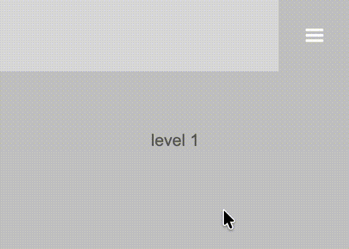
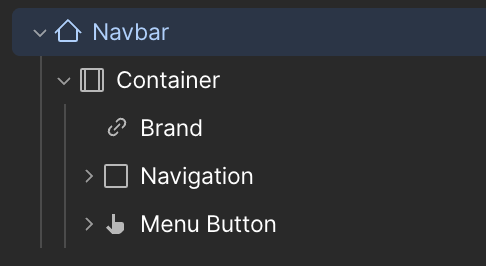
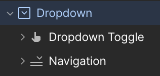
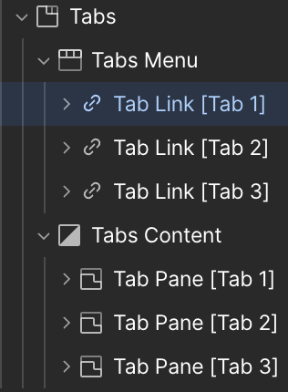
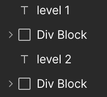
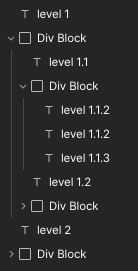

# Multilevel MobileMenu: A Webflow Library for nice mobile menus with deep navigation

> **Create unlimited submenus that slide in when clicking a navigation item — and style them however you want!**

## 🚀 What is it?

Multilevel MobileMenu is a lightweight JavaScript library for multilevel mobile navigation menus. It works by reading `data-` attributes you add in Webflow's Designer. The script only manages classes and ARIA attributes — all visual design is yours.



## ⚡ Step 1: Getting Started

### Add the <head> code

Add the following code inside the `<head>` tag in your Webflow Project Settings (or Page Settings)

```html
<!-- Install Multilevel Mobile Menu -->
<link rel="stylesheet" href="https://cdn.jsdelivr.net/gh/ulrichbenedikt/mobileMenu@latest/mobile-menu.css">
<script src="https://cdn.jsdelivr.net/gh/ulrichbenedikt/mobileMenu@latest/index.js"></script>
```

To pin a specific version, replace `@latest` with a version tag like `@v1.0.0`.

---

## 🏡 Step 2: Further Setups

### Add the Navbar

In the Webflow Designer add a Navbar to your page and give it a unique ID

Select the **Navbar** element → open the **Element Settings** panel (the gear icon) → set an **ID**, for example `navbar`.



### Add a Back Button 

Add a Back Button inside the Navigation Div Block and give it this custom attribute

```
data-mobile-menu-back
```

> **Important:** Place only **one** back button anywhere inside the Navigation Div Block. The library shows it automatically when a submenu is open and hides it at the root level.
> **Important:** Do not use a Webflow **Link Block** or **Button** element for the back button. Use a **Div Block** or **Text Block** instead. Webflow's link and button elements trigger their own click behaviour that closes the mobile overlay — a plain div avoids this.
> **Important:** Keep the Back Button inside the **Navigation Div Block**. Placing it outside will trigger Webflows click behaviour that closes the mobile overlay — a plain div avoids this.

## 🌟 Step 3: The Multilevel Menu

Choose one of the following approaches depending on your preferred Webflow structure. You can mix and match freely.

> **Important:** Keep the elements inside the **Navigation Div Block**. Placing it outside will trigger Webflows click behaviour that closes the mobile overlay — a plain div avoids this.

### Option A — The Dropdown Element
<details>
<summary><strong>Details</strong></summary>

Add a **Dropdown** element inside the Navigation Div Block.



Add this custom attribute to the **Dropdown Toggle** (the clickable label). Replace `cars` with any name of your choice — you will use the same name on the matching panel.

```
data-submenu-trigger="cars"
```

Add this custom attribute to the **Dropdown List** (the panel that holds the submenu items). Use the **same name** as above.

```
data-submenu="cars"
```

</details>

### Option B — The Tabs Element

<details>
<summary><strong>Details</strong></summary>

Add a **Tabs** element inside the Navigation Div Block.



Add this custom attribute to each **Tab Link** inside the **Tabs Menu**. Give each Tab Link a different name.

```
data-submenu-trigger="cats"
```

Add this custom attribute to each **Tab Pane** inside the **Tabs Content**. Use the **same name** as the matching Tab Link above.

```
data-submenu="cats"
```

</details>

### Option C — Custom Div Block or Text Element

<details>
<summary><strong>Details</strong></summary>

Add a **Heading**, **Paragraph**, **Text Block**, or **Div Block** that will act as the clickable nav item inside the Navigation Div Block, .

Add this custom attribute to that element. Replace `cows` with any name of your choice.

```
data-submenu-trigger="cows"
```

Below it, add a **Div Block** that holds the content which should appear when the nav item is clicked.
Add this custom attribute to that Div Block, using the **same name** as above.

```
data-submenu="cows"
```



</details>

---

## 🌻 Step 4: Initiate everything
Add the initialisation script before the `</body>` tag in your Webflow Project Settings (or Page Settings)

Replace `#navbar` with the ID you set on your Navbar in step 2.

```html
<script>
  new MobileMenu('#navbar').mount();
</script>
```

If you want to change default options, replace the values in the option section with your own data. You find more information in the chapter **⚙️ Options** below.
```html
<script>
new MobileMenu('#navbar', {
  breakpoint: 900,
  animationDuration: 300,
  animationEasing: 'ease',
}).mount();
</script>
```

---

## 💻 HTML Attributes Reference

### On the Navbar

| Attribute | Required | Description |
|---|---|---|
| `id="your-id"` | Yes | The ID you pass to the `MobileMenu` constructor. Using an ID guarantees the element is unique on the page. |

### On the toggle button

| Attribute | Required | Description |
|---|---|---|
| `data-mobile-menu-toggle` | No | Marks a button that opens and closes the mobile nav. **In Webflow you do not need this** — Webflow's built-in hamburger button already handles opening and closing the nav overlay. This attribute is only needed when using this library outside of Webflow. |
| `data-mobile-menu-toggle="#your-id"` | No | Same as above, but scoped to a specific nav. Useful when multiple menus exist on the same page. |

### On navigation items

| Attribute | Required | Description |
|---|---|---|
| `data-submenu-trigger="name"` | — | Clicking this element opens the submenu panel whose `data-submenu` value matches `name`. Use a **Div Block**, **Heading**, **Paragraph**, **Text Block**, **Dropdown Toggle**, or **Tab Link** — never a **Link Block** or **Text Link**, as those trigger Webflow's native close-menu behaviour. |
| `data-submenu="name"` | — | Marks a submenu panel. Must match the `name` used on its trigger. |
| `data-mobile-menu-back` | — | Marks the back button. Place it once anywhere inside the Navbar. It appears automatically when a submenu is open and disappears at the root level. Use a **Div Block** or **Text Block**, not a Link or Button element. |

---

## ⚙️ Options

Pass an options object as the second argument to the constructor.

```js
new MobileMenu('#navbar', {
  breakpoint: 900,
  animationDuration: 300,
  animationEasing: 'ease',
}).mount();
```

| Option | Type | Default | Description |
|---|---|---|---|
| `breakpoint` | `number` | `900` | The library is active below this pixel width. At or above it, all submenus are closed and interactions are disabled. |
| `animationDuration` | `number` | `300` | Slide-in/slide-out duration in milliseconds. |
| `animationEasing` | `string` | `'ease'` | CSS easing for the slide transition. Keyword values: `'ease'` `'linear'` `'ease-in'` `'ease-out'` `'ease-in-out'`. Custom curve: `'cubic-bezier(x1, y1, x2, y2)'` e.g. `'cubic-bezier(0.4, 0, 0.2, 1)'`. Step function: `'steps(n)'` e.g. `'steps(4)'`. |

The active class added to open submenu panels and the back button is always `is-active`. Use this class in Webflow's Style Manager to apply custom styles to the open state.

---

## 🛠️ Methods

All methods return `this`, so they are chainable.

```js
const menu = new MobileMenu('#navbar').mount();

menu.open();    // programmatically open the nav
menu.close();   // programmatically close the nav and reset to root level
menu.destroy(); // remove all event listeners
```

---

## 🎨 CSS

The `mobile-menu.css` file (loaded via jsDelivr in step 1) contains all structural styles required for the slide-in behaviour. No additional CSS is needed for the mechanics to work.

It covers:
- Positioning submenu panels so they cover the entire nav area
- The slide-in/slide-out transition
- Showing and hiding the back button based on navigation depth

---

## 🎭 Multi-Level Nesting

Place a `data-submenu-trigger` element inside a `[data-submenu]` panel to create nested submenus. The library tracks the navigation history internally, so the back button always returns to the correct parent level no matter how deep you go.



There is no hard limit on nesting depth.

---

## 🧪 Multiple Menus on the Same Page

Create a separate instance for each menu and scope each toggle button to its nav using the nav's ID as the attribute value:

```html
<button data-mobile-menu-toggle="#main-nav">Main menu</button>
<nav id="main-nav">...</nav>

<button data-mobile-menu-toggle="#footer-nav">Footer menu</button>
<nav id="footer-nav">...</nav>
```

```js
new MobileMenu('#main-nav').mount();
new MobileMenu('#footer-nav').mount();
```

---

## 🤝 Accessibility

The library automatically manages the following ARIA attributes:

| Attribute | Element | Value |
|---|---|---|
| `aria-expanded` | Toggle button | `true` when open, `false` when closed |
| `aria-hidden` | Each `[data-submenu]` panel | `false` when active, `true` otherwise |
| `aria-hidden` | `[data-mobile-menu-back]` | `false` when a submenu is open, `true` at root level |

---

## 🌐 Browser Support

Uses `matchMedia`, `closest`, and `addEventListener` — supported in all modern browsers.
